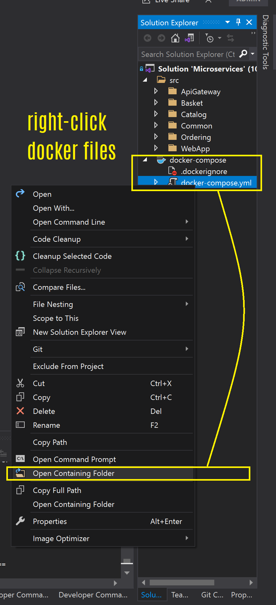
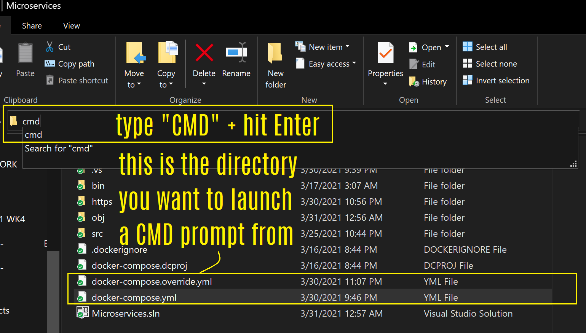
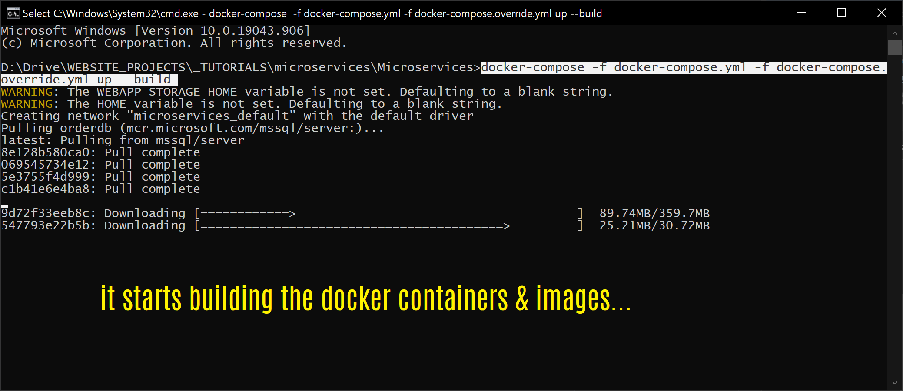
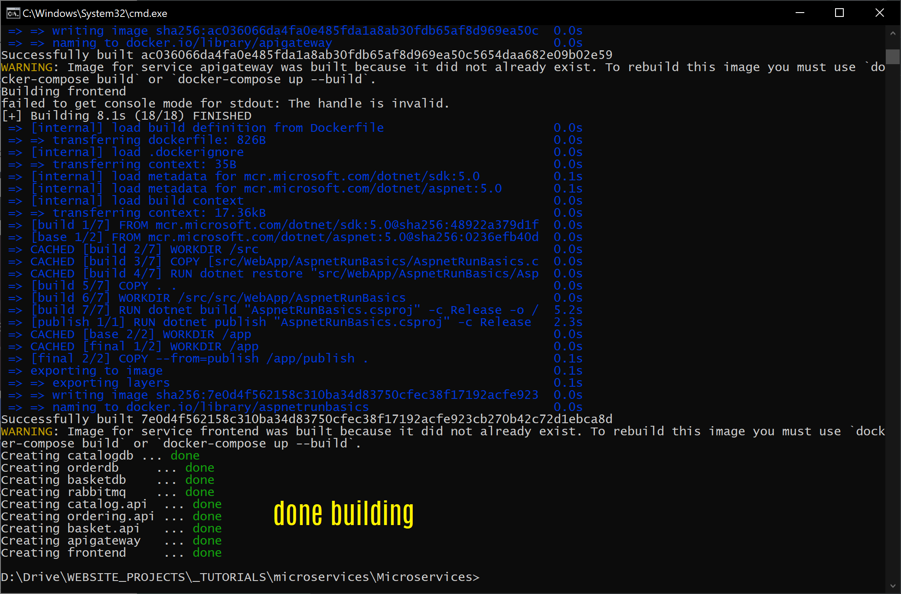
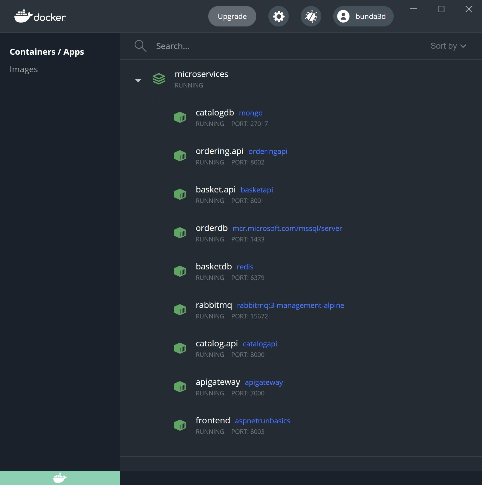
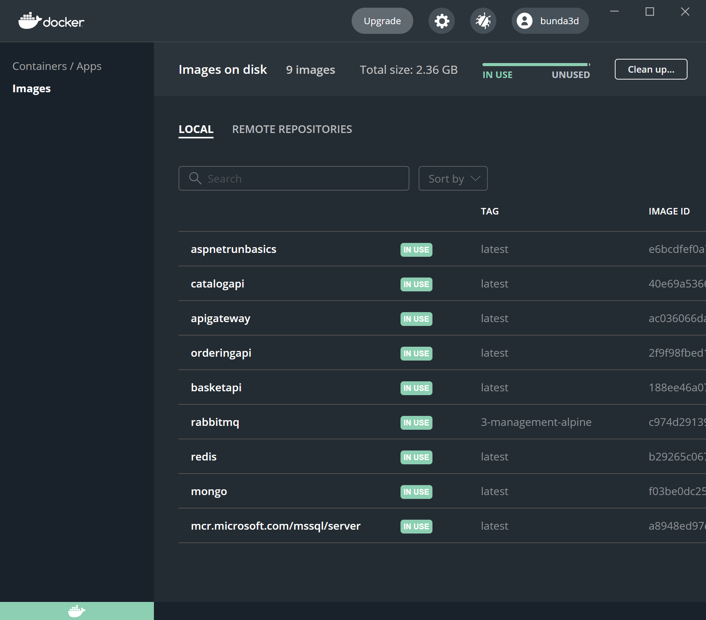
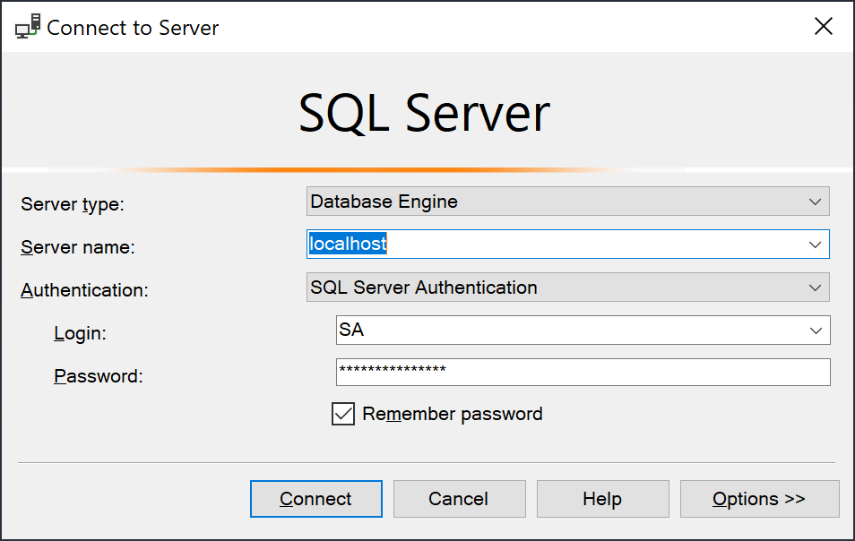
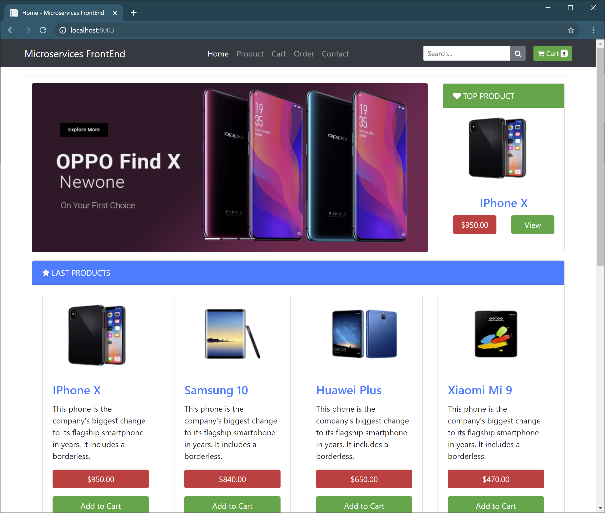

# microservices
Microservices Solution | supporting an e-commerce app with cart, ordering, and checkout queues.

## Technologies:
ASP.NET Core 5.0, RabbitMQ, SQL Server, MongoDb, Redis, Docker, Docker Compose files (for auto-rebuild of app and containers + images), Swagger, AutoMapper, Mediator, etc.

## Architecture Styles:
Using "Clean" (N-Layer) architecture, SOLID principles, Domain Driven Design (DDD), CQRS (Command Query Responsibility Segregation), etc.

### Since the author changed this course significantly...
I'm copying the part of his readme here that instructs how to download and install all the docker containers. Otherwise he plans to remove this "old" part of the course in the next 2 weeks (of 2021.03.30). 

* [Mehmet Özkaya of aspnetrun](https://github.com/aspnetrun/run-aspnetcore-microservices)


## Run The Project
You will need the following tools:

* [Visual Studio 2019](https://visualstudio.microsoft.com/downloads/)
* [.Net Core 3.1 or later](https://dotnet.microsoft.com/download/dotnet-core/3.1)
* [Docker Desktop](https://www.docker.com/products/docker-desktop)


### Installing
Follow these steps to get your development environment set up: (Before Run Start the Docker Desktop)
1. Clone the repository
2. At the root directory which include **docker-compose.yml** files, run below command:
```csharp
docker-compose -f docker-compose.yml -f docker-compose.override.yml up --build
```


Tip: go to that directory in Windows Explorer, click into the address bar, type "CMD" and hit Enter; this will open a CMD Prompt in the appropriate directory



After entering command, watch the Docker build.



3. Wait for docker to compose all microservices. That’s it!



Your containers may look like this: 



Your images may look like this: 




## You can **launch microservices** as below urls:
* **RabbitMQ -> http://localhost:15672/** (both user & pw = "guest")
* **Catalog API -> http://localhost:8000/swagger/index.html**
* **Basket API -> http://localhost:8001/swagger/index.html**
* **Order API -> http://localhost:8002/swagger/index.html**
* **API Gateway -> http://localhost:7000/Order?username=Yolo**
* **Web UI -> http://localhost:8003/**

### SQL Server Container
If you need a login to the SQL Server container, try this: ( server on localhost, user: SA pw: Pwd!4321 ).
If all else fails, try running this in CMD prompt: 
```csharp
docker run -e "ACCEPT_EULA=Y" -e "SA_PASSWORD=Pwd!4321" -p 1433:1433 -d mcr.microsoft.com/mssql/server
```
#### Logging into SSMS may look like this: 




## Launch http://localhost:8003/ in your browser to view the Web UI. 
You can use Web project in order to **call microservices over API Gateway**. When you **checkout the basket** you can follow **queue record on RabbitMQ dashboard**.



